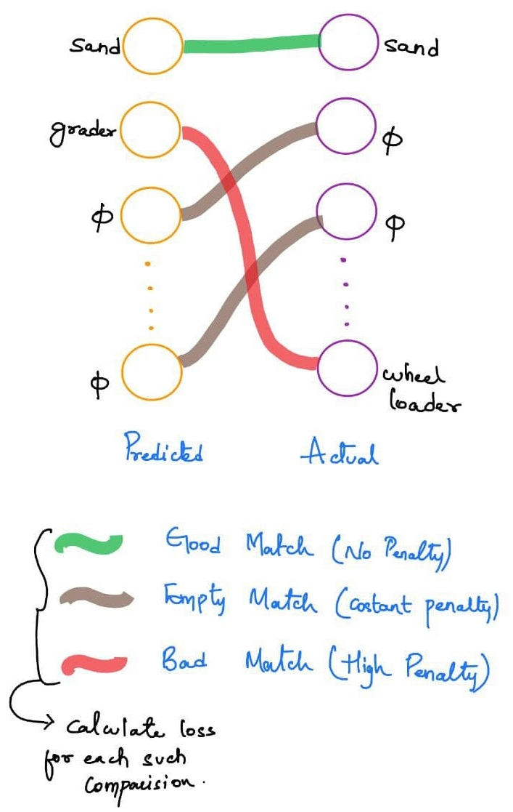
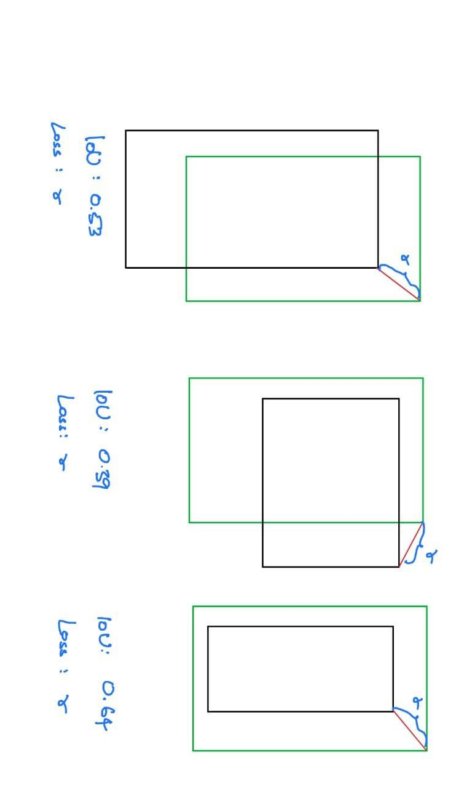
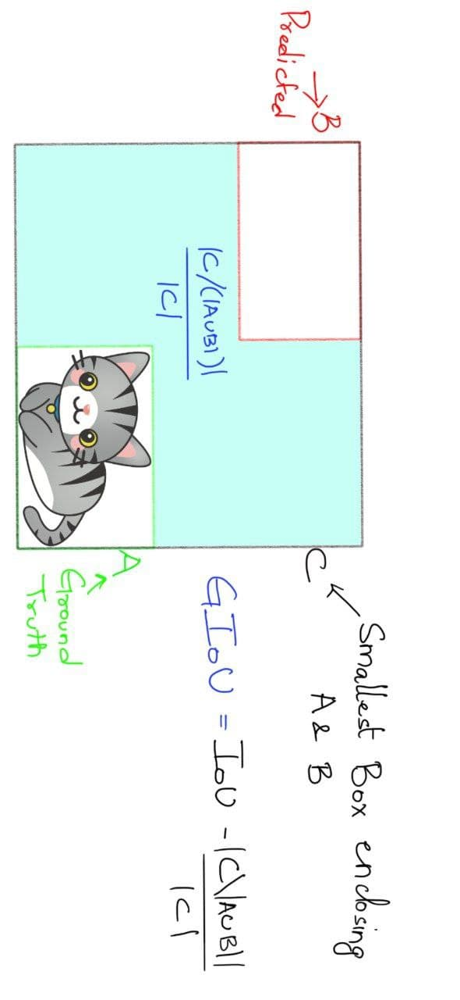
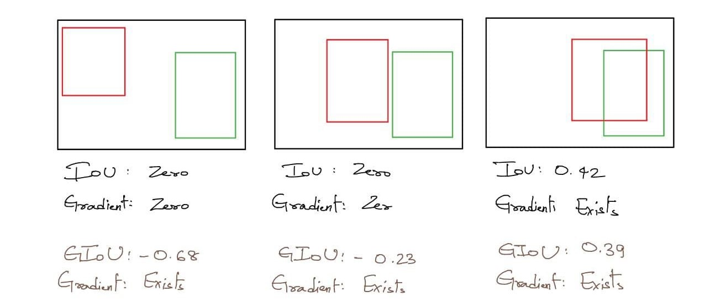

# What is DETR?

## Finds let's know what is Object Detection

Object detection refers to the capability of computer and software systems to locate objects in an image/scene and identify each object.  
Object detection has been widely used for face detection, vehicle detection, pedestrian counting, web images, security systems and driverless cars.

## How DETR approach the problem?

`DETR` streamlines the detection pipeline, effectively removing the need for many hand-designed components like a `non-maximum suppression` procedure or `anchor generation`
that explicitly encode our prior knowledge about the task. The main ingredients of the new framework, called `DEtection TRansformer` or `DETR`, are a `set-based global loss` that forces unique predictions via `bipartite matching`, and a `transformer encoder-decoder architecture`.  

Given a fixed small `set of learned object queries`, DETR reasons about the relations of the objects and the global image context to directly output
the final set of predictions in parallel. The new model is conceptually simple and does not require a specialized library, unlike many other modern detectors.

DETR demonstrates accuracy and run-time performance on par with the well-established and highly-optimized Faster RCNN baseline on the challenging COCO object detection dataset. Moreover, DETR can be easily generalized to produce panoptic segmentation in a unified manner

Another helpful aspect unlike most existing detection methods, DETR doesn’t require any customized layers, and thus can be reproduced easily in any framework that contains standard CNN and transformer classes.

# Architecture

## Transformer - Attention is all you need.

`Transformers` introduced in 2017, came up with a novel approach of `Self-Attention Mechanism` where each element scan through every other element of a sequence and update it by aggregating information from the whole sequence.

The `Transformers` changed the entire NLP domain, but wasn't used until 2020 in the Computer Vision domain by the introduction of `Vision Transformers`. (more on it [here](https://github.com/abdksyed/ViT)).

DETR uses the same `Self-Attention Mechanism` in their `Encoded-Decoder` architecture.

In `ViT` the images are converted to patches and than flattened and passed through the Linear Projection layer. to get `image embeddings` which are added with `positional embeddings`. But in DETR, we use a `ResNet50` trained on `ImageNet` as a Backbone, and the final feature map from ResNet-5 block is taken the shape of the feature map is `d x H/32 x W/32` and it is converted to embeddings by `flattening it on H and W`, and transposing it to become, `196x256` (HW x 256) as Transformers accept such sequential embeddings.

DETR uses `Encoder-Decoder` architecture, Each encoder layer has a standard architecture and consists of a multi-head self-attention module and a feed forward network (FFN). Since the transformer architecture is permutation-invariant, it is supplemented with fixed positional encodings that are added to the input of each attention layer. DETR used 6 encoders.

TThe decoder follows the standard architecture of the transformer, transforming N embeddings of size d using multi-headed `encoder-decoder attention` and `self-attention mechanisms`, with the only difference that DETR model decodes the N objects in parallel at each decoder layer, while original Transformer use an autoregressive model that predicts the output sequence one element at a time.

Since the decoder is also permutation-invariant, the N input embeddings must be different to produce different results. These input embeddings(to the decoder) are `learnt positional encodings` that are refer to as **`object queries`**, and similarly to the encoder, we add them to the input of each attention layer.  
The N object queries are transformed into an output embedding by the decoder. They are then independently decoded into box coordinates and class labels by a feed forward network, resulting N final predictions. Using self and encoder-decoder attention over these embeddings, the model globally reasons about all objects together using pair-wise relations between them, while being able to use the whole image as context.

## Prediction through Feed Forward Network

The final prediction is computed by a `3-layer perceptron` with `ReLU` activation function and hidden dimension d, and a linear projection layer. The FFN predicts the `normalized center coordinates, height and width of the box w.r.t. the input image`, and the linear layer predicts the `class label using a softmax` function. Since we predict a
fixed-size set of N bounding boxes, where *N is usually much larger than the actual number of objects* of interest in an image, an additional *special class label ∅* is used to represent that no object is detected within a slot. This class plays a similar role to the “background” class in the standard object detection approaches.

# LOSS
> Let's see how DETR is trained

## Set Prediction Loss

DETR infers a *fixed-size set of N predictions*, in a single pass through the decoder, where N is set to be significantly larger than the typical number of objects in an image. Since there are large number of predictions, which as said is more than objects present in the image, one of the main difficulties arises in training is to score predicted objects (class, position, size) with respect to the ground truth.  
DETR loss produces an optimal bipartite matching between predicted and ground truth objects, and then optimize object-specific (bounding box) losses, more specifically the `Hungarian algorithm` which is a “combinatorial optimization algorithm that solves the assignment problem in polynomial time”. [ref](https://en.wikipedia.org/wiki/Hungarian_algorithm)

One of the main benefits of this approach is that it simply produces a set of predictions rather than a list, meaning that the produced boxes are unique (which saves a lot of post-processing time). It also allows them to do box predictions directly rather than doing those predictions with respect to some initial guesses.

The matching is to account for ordering differences in the permutations of the predictions compared to the ground truth. Given a particular loss function ${L}_{match}(\hat{y}, y)$, it finds the permutation for the predictions that gives the minimum total loss. The matching checks the possibilities of all permutations, and selects the one that minimizes the total loss, giving the model the benifit of *best possible matching* to set of predictions.

This matching portion plays the same role as heuristic rules used to match proposal or anchors to past ground truth objects in past object detection models. The solution for the above problem is found using the `Hungarain Algorithm`. As can be seen from the above image, the name for the loss function comes from the Bipartite Graph that is seen in graph theory.

$$
\hat{\sigma} = arg \min\limits_{\sigma \epsilon N} \sum\limits_{i=1}^{N} L_{match}(\hat{y}_i, y_i)
$$

## Matching Loss

We have seen that the bipartite matching, tries to calculate the matching loss and find the set of matching which gives the least sum of matching loss of each element. Let's see what is the Matching loss being used here.

${L}_{match}(\hat{y}, y)$  is a pair-wise matching cost between ground truth $y_{i}$ and a prediction with index $\sigma (i)$. The matching cost takes into account both the class prediction and the similarity of predicted and ground truth boxes.  
Each element i of the ground truth set can be seen as a $y_{i} = (c_{i}, b_{i})$ where $c_{i}$ is the target class label (which may be ∅) and $b_{i}${i}$ ∈ [0, 1] is a vector that defines ground truth box center coordinates and its height and width relative to the image size. 
For the prediction with index $\sigma (i)$ we define probability of class $c_{i}$ as $\hat p_{\sigma(i)}(c_{i})$ and the predicted box as $\hat b_{\sigma(i)}$. With these notations we can define ${L}_{match}(\hat{y}, y)$ as 

$$
{L}_{match}(\hat{y}, y) = −1_{\{c_{i}=\phi\}} \hat p_{\sigma (i)} (c_{i}) + 1_{\{c_{i}=\phi\}}{L}_{box} (b_{i}, \hat b_{\sigma(i)}).
$$

Now, to compute the loss function, the Hungarian loss for all pairs matched in the previous step. We can define the loss similarly to the losses of common object detectors, i.e. a linear combination of a negative log-likelihood for class prediction and a box loss.

$$
{L}_{Hungarian}(y, \hat{y}) = \sum\limits_{i=1}^{N} [ -log\hat p_{\sigma (i)} +  1_{\{c_{i}=\phi\}}{L}_{bbox}(b_{i}, \hat b_{\sigma(i)}) ]
$$

In actual, the log-probability term when class = $\phi$ is down-weighted by factor of 10 to account for class-imbalance, as there will be very high number of no-objects in the dataset with 100 queries in each image and number of classes being less than that.

### Bounding Box Loss

The bounding box loss discussed above is a combination of ${L1}$ loss adn the generalized IOU loss. Unlike tradional object detectors which do box prediction based on initial guess like anchors or proposals, DETR make box predictions directly.

$$
{L}_{bbox}(b_{i}, \hat b_{\sigma(i)}) = \lambda_{iou}{L}_{iou}(b_{i}, \hat b_{\sigma(i)}) + \lambda_{L1}||b_{i}, \hat b_{\sigma(i)}|
$$
where $\lambda_{iou} and \lambda_{L1}$ are hyperparameters.

### Why Generalized IOU Loss and not just IOU?

The IOU loss is a loss function that measures the similarity between two boxes. The IOU loss is defined as `intersection` over the `union` of the two boxes, it has great properties of `scale-invariance`  and have been used as a metric in many tasks of detection and segmentation, but it can't be directly used as an objective function to be optimized.  
Also, there is no strong-corelation between minimizing the commonly used losses (like L2 norm) and the IOU values.

Let's assume a case, where we are calculating loss for bouding box, and consider the top-right point being calculated with L1 loss. As we can see above the IoU is varying in each case, but the distance between the top-right point of predicted and actual box is constant, hence giving same L1 Norm values.

Where as the generalized IoU, takes into account the distance between the predicted box and the actual box even if the boxes are not overlapping.

The genaralized IoU is defined as   
$$
GIoU = IoU - \frac{|C-(A \cup B)|}{|C|}
$$

## Auxiliary Decoding Losses

It was found helpful to use auxiliary losses in decoder during training, especially to help the model output the correct number of objects of each class. We add prediction FFNs and Hungarian loss after each decoder layer. All predictions FFNs share their parameters. We use an additional shared layer-norm to normalize the input to the prediction FFNs from different decoder layers.

